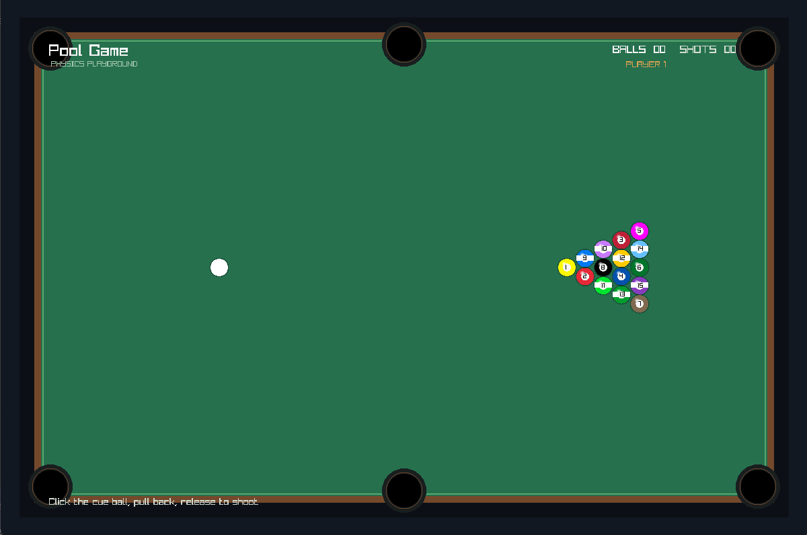
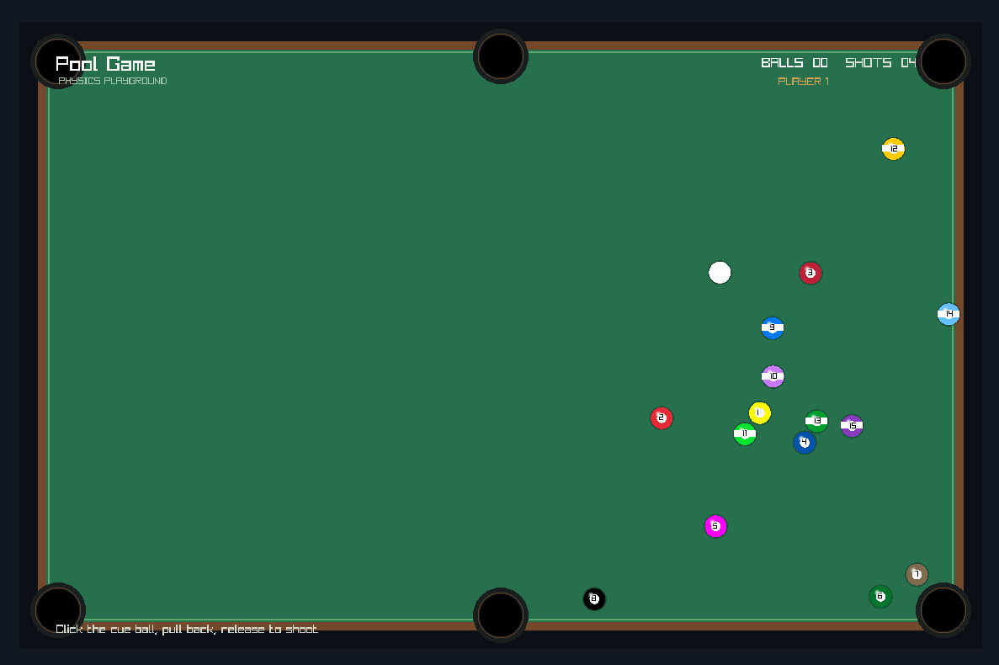
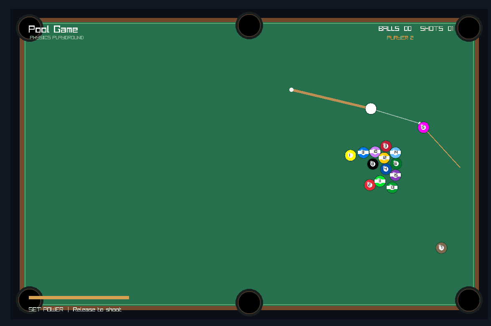

# Pool Game made with a native physics engine

### A real-time 2D physics engine presented as a playable two-player 8-ball pool game

<p align="center">
  <strong>Interactive simulation. Spatial partitioning. Deterministic-feeling gameplay.</strong><br>
  A focused C++ project demonstrating practical computer science fundamentals through a polished visual application.
</p>

<p align="center">
  
  
  
</p>

## Overview

Pool Game made with a native physics engine is a compact 2D physics engine wrapped in an interactive two-player 8-ball pool experience. It models moving bodies, collision response, cushion bounces, pocket detection, spatial broad-phase queries, turn ownership, rack setup, and visual aiming feedback in real time.

The project is deliberately focused: the result is easy to demonstrate while the underlying implementation provides concrete topics for discussion in a computer science application, including numerical integration, vector geometry, collision detection, spatial data structures, state machines, and native build systems.

## Features

### Gameplay

- Two-player local pass-and-play 8-ball pool.
- Standard 15-ball triangular rack with the 8-ball in the center.
- Proper solids and stripes rack ordering.
- Six pockets: four corners and two side pockets.
- Drag from the cue ball to aim and set shot power.
- Cue-ball guide that stops at the first ball in its path.
- Target-ball guide based on the collision normal for realistic cut-shot angles.
- Power meter, current-player indicator, shot counter, and pocketed-ball counter.
- Solids/stripes assignment after the first object ball is pocketed.
- Turn retention after pocketing the current player's group.
- Turn handoff after a miss or scratch.
- Scratch handling with cue-ball reset.
- 8-ball win and foul states.
- `R` key rack reset.

### Physics engine

- Verlet-style position integration using current and previous positions.
- Frame-time clamping and eight physics substeps per rendered frame.
- Friction/damping for gradual rolling to rest.
- Ball-ball overlap correction and impulse-like collision response.
- Cushion constraints with configurable restitution.
- Pocket collision detection.
- Uniform spatial grid broad-phase collision detection.
- Narrow-phase circle collision resolution.
- Separation between simulation, game rules, input, and rendering.

## Technical stack

| Area | Technology |
| --- | --- |
| Language | C++17 |
| Rendering and input | raylib 6.x |
| Build system | CMake 3.14+ |
| Build backend | Ninja CMake generator |
| Platform tested | Windows 10/11 |
| Graphics API | OpenGL through raylib |
| Dependencies | raylib and its Windows system libraries |

The project uses no external game framework or physics middleware. The engine concepts are implemented directly in the repository so the algorithms remain visible and suitable for study.

## Architecture

The code is split into small components with clear ownership boundaries:

```text
PhysicsEngine/
├── CMakeLists.txt
├── compile_flags.txt
├── README.md
├── include/
│   ├── ball.hpp          Ball state and integration API
│   ├── grid.hpp          Uniform-grid broad phase
│   ├── physics.hpp       Pockets and collision API
│   ├── pool_game.hpp     Game, renderer, and aim-guide interfaces
│   └── vector2.hpp       Lightweight 2D vector operations
├── src/
│   ├── main.cpp          Window lifecycle and application entry point
│   ├── pool_game.cpp     Pool rules, simulation, input, and rendering coordination
│   ├── ball.cpp          Verlet integration and table constraints
│   ├── physics.cpp       Circle collision response and pocket checks
│   ├── grid.cpp          Spatial grid implementation
│   └── assets/           Project screenshots used in this document
└── build/                Local generated CMake output; do not commit
```

### Runtime flow

Each frame follows this sequence:

1. Read keyboard and mouse input.
2. Allow aiming only when the table has settled.
3. Convert a drag gesture into capped cue-ball velocity.
4. Run eight small physics substeps.
5. Clear and repopulate the spatial grid.
6. Query neighboring cells for possible ball pairs.
7. Resolve circle collisions and table constraints.
8. Detect pocket events and update game rules.
9. Hand off or retain the turn when all moving balls stop.
10. Render the table, balls, guides, and HUD.

## Physics notes

### Verlet integration

The engine stores a ball's current position $\mathbf{x}_t$ and previous position $\mathbf{x}_{t-\Delta t}$ instead of maintaining a separate velocity state. The implicit velocity is approximated by:

$$
\mathbf{v}_t \approx \mathbf{x}_t - \mathbf{x}_{t-\Delta t}
$$

The next position is integrated as:

$$
\mathbf{x}_{t+\Delta t} = \mathbf{x}_t + \lambda \mathbf{v}_t + \mathbf{a}\Delta t^2
$$

where $\lambda$ is the friction/damping factor. This is simple and stable for a constrained table simulation and naturally supports positional collision correction.

### Collision response

For two balls with centers $\mathbf{p}_1$ and $\mathbf{p}_2$, the collision normal is:

$$
\mathbf{n} = \frac{\mathbf{p}_1 - \mathbf{p}_2}{\|\mathbf{p}_1 - \mathbf{p}_2\|}
$$

When the distance between centers is less than the sum of their radii, the balls are separated along $\mathbf{n}$ and their relative normal motion is adjusted using a restitution factor.

### Spatial grid

The table is divided into fixed-size cells. Each active ball is inserted into the cell containing its center. A ball queries its own cell and the surrounding eight cells, reducing unnecessary narrow-phase checks as the number of balls increases.

With an all-pairs approach, collision candidate generation costs $O(n^2)$. A uniform grid reduces the typical candidate set to nearby objects, making the broad phase approximately linear for a reasonably distributed table state.

### Aim guide

The cue guide tests the cue direction against every active object and selects the nearest valid circle intersection. At the contact point, the target-ball guide follows the line of centers, which is the collision normal for two equal-radius balls. This makes the target trajectory change correctly for cut shots instead of always remaining parallel to the cue path.

## Building on Windows

### Prerequisites

- Windows 10 or Windows 11.
- CMake 3.14 or newer.
- A C++17 compiler.
- raylib 6.x with headers and libraries available.
- Ninja is recommended for the included workflow.

The current CMake configuration expects raylib at:

```text
C:\raylib\w64devkit\include
C:\raylib\w64devkit\lib
```

If raylib is installed elsewhere, update the include and library paths in `CMakeLists.txt` or provide equivalent CMake toolchain settings.

### Configure and compile

From the repository root:

```powershell
cmake -S . -B build -G Ninja
cmake --build build
```

Run the game:

```powershell
.\build\PhysicsEngine.exe
```

If the raylib compiler cannot locate its internal GCC executable, add the raylib compiler directories to the current PowerShell session before building:

```powershell
$env:PATH = "C:\raylib\w64devkit\bin;C:\raylib\w64devkit\libexec\gcc\x86_64-w64-mingw32\15.2.0;$env:PATH"
cmake --build build
```

The GCC version directory is installation-specific. Use the directory present under `C:\raylib\w64devkit\libexec\gcc\x86_64-w64-mingw32`.

### CMake notes

The project collects all `.cpp` files under `src/` through CMake's source glob, links raylib, and links the Windows libraries required by the raylib desktop target: `opengl32`, `gdi32`, and `winmm`.

## Controls

| Input | Action |
| --- | --- |
| Left mouse button on cue ball | Begin aiming |
| Drag away from cue ball | Set direction and power |
| Release left mouse button | Shoot |
| `R` | Reset the rack |
| Close window / `Esc` | Exit |

## Game rules implemented

The current rules are intentionally lightweight but recognizable as 8-ball pool:

- Player 1 starts the rack.
- The first non-8 object ball pocketed assigns that player's group.
- The other player receives the opposite group.
- Pocketing a ball from the current player's group retains the turn.
- Missing, scratching, or pocketing only an opponent's group passes the turn.
- Pocketing the 8-ball after clearing the player's group wins.
- Pocketing the 8-ball before the player's group is cleared produces a foul/game-over state.

This is a local arcade-style ruleset rather than a tournament rules engine. Call-shot declarations, break-specific rules, ball-in-hand placement, and foul histories are intentionally outside the current scope.

## Development workflow

1. Configure the project with CMake.
2. Build with `cmake --build build`.
3. Run the executable and test a rack manually.
4. Check editor diagnostics for modified files.
5. Keep gameplay state changes inside `PoolGame` and rendering changes inside `TableRenderer`.
6. Regenerate CMake after adding new source files.

For a larger feature, isolate behavior in a focused class or function before extending the update loop. Physics constants currently live near their owning implementation and can be promoted into a configuration object if runtime tuning is introduced.

## Extension roadmap

- Add cue-ball placement and full ball-in-hand rules.
- Add a formal `ShotResult` model and foul event history.
- Add cushion tangential friction and more realistic rolling resistance.
- Add angular velocity, spin, and visual ball rotation.
- Add deterministic replay recording from input events.
- Add unit tests for vector math, grid queries, collision response, rack layout, and aim intersections.
- Add a debug overlay for cell occupancy, collision normals, and frame timings.
- Replace parallel vectors for ball metadata with a `BallState` model.
- Add continuous collision detection for very high-speed shots.
- Add a portable raylib discovery path through CMake instead of absolute paths.

## Contributing

Fork the repository, create a focused branch, and keep changes small enough to review:

```bash
git clone https://github.com/zaimhalili/PhysicsEngine.git
cd PhysicsEngine
git checkout -b feature/your-change
```

Before opening a pull request:

- Build from a clean or regenerated `build/` directory.
- Confirm the executable starts and accepts a shot.
- Test both player turns, scratches, pocketing, resets, and 8-ball outcomes when relevant.
- Avoid committing generated build output.
- Explain the physics or gameplay reasoning behind behavior changes.

## Academic value

This project demonstrates practical use of:

- C++ object-oriented decomposition and header/source separation.
- Real-time update/render loops.
- Numerical integration and stability tradeoffs.
- Vector algebra and geometric intersection tests.
- Broad-phase and narrow-phase collision detection.
- Spatial data structures and complexity analysis.
- State machines for input and game rules.
- API design between simulation, gameplay, and presentation layers.
- CMake-based native build configuration.

It is suitable as a portfolio or university application project because the visual result is immediately demonstrable while the implementation provides concrete areas for technical discussion: why Verlet integration was chosen, how the grid changes collision workload, how aim geometry is derived, and how game state is separated from drawing code.

## License

No license file is currently included. Add a license before distributing forks or accepting external contributions. Until then, treat the repository as source-available for evaluation and personal study, subject to the terms of its dependencies.

## Project status

Active educational prototype with a playable two-player loop, real-time physics, rack setup, aim visualization, and modular game/rendering organization. The project is production-minded in structure, but it is not yet a competitive online pool product or a fully rules-compliant tournament simulator.
